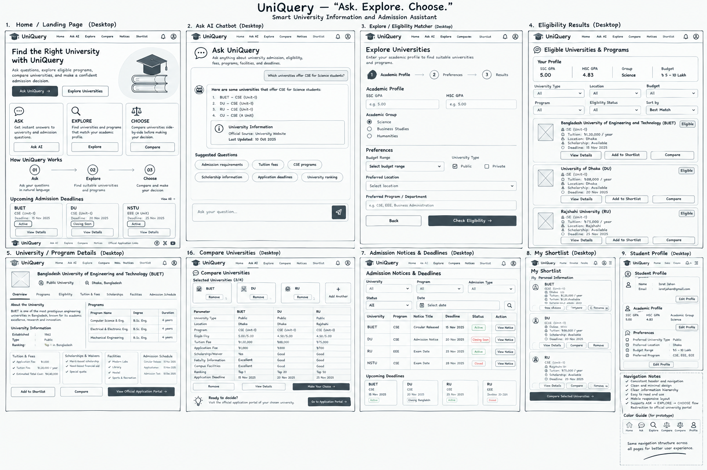

# UniQuery — “Ask. Explore. Choose.”

### A Smart University Information and Admission Assistant

**Course:** Software Project Design & Development (CSE 416)  
**Academic Session:** Autumn 2026  
**Supervisor:** Dr. Mahfida Amjad Dipa, Senior Teacher, Department of CSE

### Prepared By
- **Israt Jahan**
- **Md. Mehedi Hasan**

---

## 1. Project Overview

**UniQuery** is a smart university information and admission assistant designed to help admission-seeking students search, evaluate, and compare university options using their academic profile, preferences, and available university information.

The system follows the three-stage workflow:

**ASK → EXPLORE → CHOOSE**

- **ASK:** Conversational AI assistance for admission-related questions.
- **EXPLORE:** Eligibility matching and university/program discovery.
- **CHOOSE:** Side-by-side comparison of shortlisted universities.

---

## 2. Key System Features

- Conversational AI Chatbot
- Smart Eligibility Matcher
- University and Program Information
- Side-by-Side University Comparison
- Admission Notices and Deadline Tracker
- Tuition Fee and Scholarship Information
- Student Profile and Shortlist Management
- Responsive Web User Interface

---

## 3. User Interface & Wireframe

The UniQuery wireframe presents the main desktop interface and follows the **ASK → EXPLORE → CHOOSE** workflow.

### UniQuery Wireframe

The wireframe contains the following **9 major screens**:

1. **Home / Landing Page**
2. **Ask AI Chatbot**
3. **Explore / Eligibility Matcher**
4. **Eligibility Results**
5. **University / Program Details**
6. **Compare Universities**
7. **Admission Notices & Deadlines**
8. **My Shortlist**
9. **Student Profile**

### 3.1 Home / Landing Page
- Introduces UniQuery with the tagline **“Ask. Explore. Choose.”**
- Provides primary actions for **Ask UniQuery** and **Explore Universities**.
- Presents the three main functions: ASK, EXPLORE, and CHOOSE.
- Shows how UniQuery works through the three-step workflow.
- Provides quick access to upcoming admission deadlines.

### 3.2 Ask AI Chatbot
- Provides a conversational interface for admission-related questions.
- Allows students to ask about admission, eligibility, fees, programs, facilities, scholarships, and deadlines.
- Includes suggested questions for common admission queries.
- Provides university information with source/update information.

### 3.3 Explore / Eligibility Matcher
- Collects academic information such as SSC GPA, HSC GPA, and academic group.
- Supports academic groups including Science, Business Studies, and Humanities.
- Includes preferences such as budget range, university type, location, and preferred program.
- Provides a **Check Eligibility** action to generate matching results.

### 3.4 Eligibility Results
- Displays the student's submitted profile.
- Provides filtering and sorting options.
- Lists suitable universities/programs with information such as tuition, location, scholarship availability, and deadlines.
- Provides actions such as **View Details**, **Add to Shortlist**, and **Compare**.

### 3.5 University / Program Details
- Presents detailed information about a selected university/program.
- Includes overview, programs, eligibility, tuition and fees, scholarships, facilities, and admission schedule.
- Provides actions to add to shortlist, compare, and access the official application portal.

### 3.6 Compare Universities
- Allows students to select multiple universities for comparison.
- Presents selected universities in a side-by-side comparison layout.
- Compares important information such as university type, location, program, eligibility, tuition fee, application fee, scholarship/waiver, facilities, ranking, and application deadline.
- Provides options to continue toward the student's choice and official application portal.

### 3.7 Admission Notices & Deadlines
- Provides filters for university, program, admission type, status, and date.
- Displays notices with deadlines, status, and view-notice actions.
- Includes an upcoming-deadlines section.
- Uses status indicators such as **Active**, **Closing Soon**, and **Closed**.

### 3.8 My Shortlist
- Stores universities selected by the student.
- Displays important information including program, tuition, scholarship, location, and deadline.
- Provides actions to view details, compare, and remove universities.
- Provides an option to compare shortlisted universities.

### 3.9 Student Profile
- Displays student information such as name and email.
- Shows academic information including SSC GPA, HSC GPA, and academic group.
- Shows preferences such as university type, location, budget range, and preferred program.
- Provides **Edit Profile** actions.
- Supports the personalized admission-assistance workflow.

---

## 4. Wireframe Design & Navigation

The wireframe uses a consistent navigation structure across the main desktop screens.

### Main Navigation
- Home
- Ask AI
- Explore
- Compare
- Notices
- Shortlist
- Profile

### Main User Journey

**HOME → ASK / EXPLORE → ELIGIBILITY RESULTS → UNIVERSITY DETAILS → COMPARE / SHORTLIST → NOTICES → OFFICIAL APPLICATION PORTAL**

The wireframe emphasizes:
- Clear information hierarchy
- Consistent navigation
- Simple and readable layouts
- Easy comparison of university options
- Quick access to deadlines and notices
- User-friendly admission assistance

---

## 5. Figma UI / Clickable Prototype

The Figma prototype is based on the submitted UniQuery wireframe and demonstrates the connected user flow between the major screens.

### Figma Prototype

[Open UniQuery Figma Prototype](https://www.figma.com/proto/vf6W3Yg0HSPzWweHDkVtlf/UniQuery?node-id=3-28092&t=ae6rSV8ojlV7ngHp-1)

---

## 6. System Workflow

1. The student accesses UniQuery through the Home page.
2. **ASK:** The student asks admission-related questions through the AI chatbot.
3. **EXPLORE:** The student enters academic information and preferences.
4. The eligibility matcher identifies suitable universities and programs.
5. The student reviews eligibility results and university details.
6. **CHOOSE:** The student compares suitable universities side-by-side.
7. The student can save selected options in **My Shortlist**.
8. The student checks admission notices and deadlines.
9. The student can proceed to the official application portal.

---

## 7. System Design

The project includes the following system models:
- Component Diagram
- Activity Diagram
- Sequence Diagram
- Fishbone Diagram

The main system components include:
- Web Interface
- AI Chatbot
- University Information Database
- Eligibility Matcher
- Comparison Dashboard
- Notice & Deadline Tracker

---

## 8. Prototype Scope

The prototype is a responsive web platform focused on:
- University information
- Admission assistance
- Eligibility matching
- University/program discovery
- University comparison
- Shortlisting
- Student profile management
- Admission notices and deadline tracking

Direct university application submission and native mobile applications are outside the current prototype scope.

---

## 9. Submitted Materials

### Wireframe
The complete UniQuery desktop wireframe is included in this repository as:

`UniQuery_Wireframe.png`

### Figma Prototype
[Open UniQuery Figma Prototype](https://www.figma.com/proto/vf6W3Yg0HSPzWweHDkVtlf/UniQuery?node-id=3-28092&t=ae6rSV8ojlV7ngHp-1)

---

## 10. Project Information

**Project:** UniQuery — A Smart University Information and Admission Assistant  
**Tagline:** Ask. Explore. Choose.  
**Course:** Software Project Design & Development (CSE 416)  
**Session:** Autumn 2026  
**Supervisor:** Dr. Mahfida Amjad Dipa  
**Department:** Department of Computer Science and Engineering

---

### End of README
